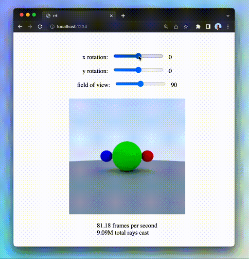

# Rust Ray Tracer (rrt)

A ray tracer built in Rust that can run in your browser via WebAssembly ([demo](https://rrt-jaymody.vercel.app)).



Based on:
- [My rust implementation of Ray Tracing In One Weekend](https://github.com/jaymody/ray-tracing-rust)
- [My experiments with Rust + WebAssembly](https://github.com/jaymody/game-of-life)
- [The excellent rpt ray tracer by Eric Zhang and Alexander Morozov](https://github.com/ekzhang/rpt).
- [My experiments with `wasm-bindgen-rayon` to support multi-threading in Rust compiled wasm via rayon](https://github.com/jaymody/rust-rayon-wasm-demo/tree/main).

### Usage
Requires `npm` and `rust`:
```shell
npm install
npm run dev
```

If you want to run the ray tracer natively in rust (rendered image is written to `output.ppm`), run the following (available examples in `crates/rrt/examples`):
```shell
cargo run --example --release scene1
```

### Deploy to Vercel
Vercel doesn't play well when builds are run on their servers, so as a workaround, we can just build locally and deploy the local build via the vercel CLI:
```shell
vercel build
vercel deploy --prebuilt
```
